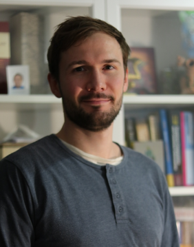

## In a Nutshell

  My name is Ben, and I am a postdoctoral researcher in computational physics and bio-inspired artificial intelligence. My research interests span from soft- and active-matter physics and non-equilibrium thermodynamics over complex biological systems to non-linear optimization and collective multi-agent-based machine learning. 

  My experience helped me to conduct cutting edge scientific research in 
  <a class="" target='blank' href="https://journals.aps.org/prl/abstract/10.1103/PhysRevLett.115.033601">quantum optics</a>, 
  <a class="" target='blank' href="https://pubs.acs.org/doi/abs/10.1021/acs.jctc.9b01251">computational materials science</a>, and
  <a class="" target='blank' href="https://www.pnas.org/content/118/19/e2019683118">reinforcement learning of decision-making strategies of cells</a>. 

My research is focused on the <a class="" target='blank' href="https://doi.org/10.3390/e26070532">Evolutionary Implications of Self-Assembling Cybernetic Materials with Collective Problem-Solving Intelligence at Multiple Scales</a>. To this end, I utilize cutting-edge multi-agent-based machine learning techniques to model and train multi-scale competency architectures that represent the foundation of biology: we deploy swarms of virtual, adaptive, communicating agents that implement a minimal model for morphogenesis of multi-cellular tissue based on individual decision-making, and we investigate how evolutionary processes and connectionist approaches operate on such hierarchical agential- rather than passive materials.

Further, I investigate how ideas from developmental biology, biophysics, and tools from [_Artificial Life_](https://en.wikipedia.org/wiki/Artificial_life) (specifically Neural Cellular Automata and neuroevolution) gear into each other and can be tuned into decentralized decision-making policies for robust autonomous navigation strategies for virtual, \textit{in-silico} microswimmers, or facilitate physiological computation in soft-matter systems.

Through this, I aim to further the understanding of learning, cognition, and (biological & artificial) intelligence as a collective, scale-free phenomenon and thus shed new light on fundamental biological processes such as computation, intelligence, and evolution.

  I am a passionate learner, a creative interdisciplinary researcher, and AI and technology enthusiast.

