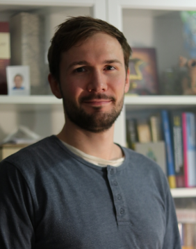

## In a Nutshell

 Hi, I'm Ben. I build machine-learning models inspired by biology and physics to understand how intelligence and artificial life emerge in physical systems.

 My work sits at the intersection of soft and active matter physics, non-equilibrium thermodynamics, complex biological systems, and collective multi-agent learning. I’m interested in how computation, adaptation, and cognition arise and integrate in composite dynamical systems. 

 During my studies at TU Wien, I worked across disciplines — from 
  <a class="" target='blank' href="https://journals.aps.org/prl/abstract/10.1103/PhysRevLett.115.033601">quantum optics</a> and 
  <a class="" target='blank' href="https://pubs.acs.org/doi/abs/10.1021/acs.jctc.9b01251">computational materials science</a> to 
  <a class="" target='blank' href="https://www.pnas.org/content/118/19/e2019683118">reinforcement learning models of cellular decision-making</a>. 
After my PhD, I collaborated with industrial partners on biologically inspired, robust autonomous navigation in maritime environments.

 My current resarch in the <a class="" target='blank' href="https://drmichaellevin.org/">Levin Lab</a> at the Allen Discovery Center at Tufts University explores the <a class="" target='blank' href="https://doi.org/10.3390/e26070532">Evolutionary Implications of Self-Assembling Cybernetic Materials with Collective Problem-Solving Intelligence at Multiple Scales</a>. I develop generative multi-agent-based machine learning techniques to model and train <a class="" target='blank' href="https://www.frontiersin.org/journals/systems-neuroscience/articles/10.3389/fnsys.2022.768201/full">multi-scale competency architectures that form the foundation of biological organization</a>: swarms of virtual, adaptive, communicating agents that implement a minimal model for evolutionary morphogenesis of multi-cellular tissue based on individual decision-making.

 More broadly, I study how developmental biology, biophysics, and artificial life methods — including 
  <a class="" target='blank' href="https://doi.org/10.1016/j.plrev.2025.11.010">neural cellular automata</a>
  and neuroevolution — can be combined to design decentralized decision-making policies. These approaches enable <a class="" target='blank' href="https://doi.org/10.48550/arXiv.2407.09438">robust autonomous navigation in virtual microswimmers</a> and open new paths toward physiological computation in soft-matter systems.

 My goal is to understand and reframe learning, cognition, and biological & artificial intelligence as a collective, scale-free phenomenon — revealing new perspectives on fundamental biological processes such as evolution, computation, intelligence, and life at the edge of order and chaos.

 I’m a curious, creative interdisciplinary scientist with a deep enthusiasm for AI, technology, physics, and (artificial) life. 

